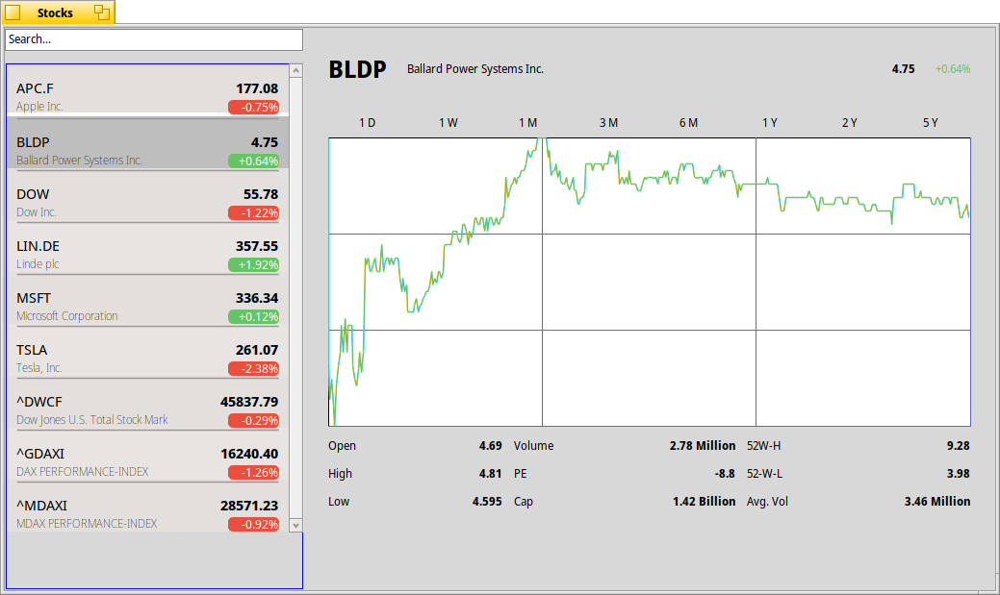

# Stocks

A stocks app for haiku.

Simple search for a stock, by its name or its symbol and monitors gain/loss, latest price and a chart.
It mimics the macOS Stocks App by layout and functions as this is small enough to be useful.

 A sample screenshot

## Install

There will be a loadable package. But for now, you have to get a developer APi key and build by your own.

## Contributing

To contribute and to run it as a developer, you need an API key provided by
https://site.financialmodelingprep.com/developer
You can sign up there for a free developer account.
Create a local environment variable
`STOCKS_APP_API_KEY`
and provide you API key. It will be injected when the project compiles.

Put your API key in your UserSetupEnvironment file under ~/config/settings/boot with a line:

```bash
export STOCKS_APP_API_KEY=YOUR_KEY
```

Just enter it in your terminal before building.

### What is missing

The project needs unit tests, graphic improvements. Ideas are welcome.
Write an issue or solve a problem. Hand in a pull request if you like.

### Author

It's me: thorstenclaus@web.de 


